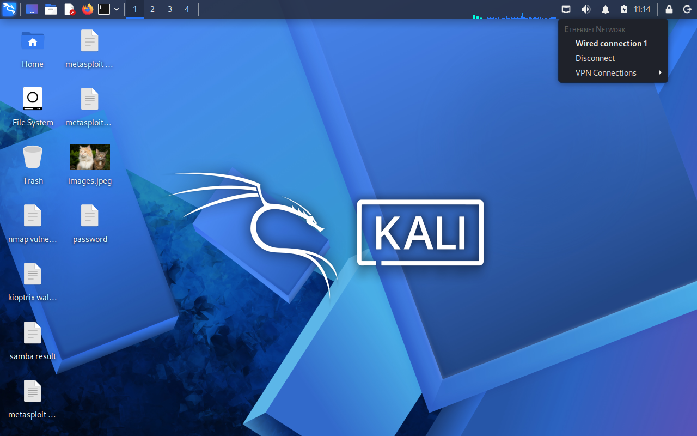
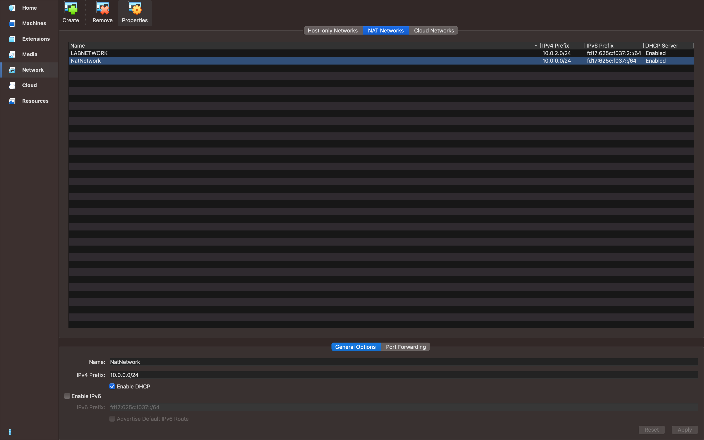

# NETWORKWALKS-B083A-WK1-CYBERSECURITY-LAB-SETUP
Virtual Lab created with VirtualBox and Kali Linux for testing.

  
  
  
  
  
  
  
  
  
  
  
  

---

## Project Overview

The project deals with the building of a *virtual cybersecurity and penetration-testing laboratory** with Kali Linux, on VirtualBox.

The objective of the lab is to create an isolated environment where the fundamental procedures of cybersecurity can be carried out safely.

---

## What I Set Out to Do

Get VirtualBox installed and configured properly
Bring in Kali Linux as my main attack/testing box
Build a private NAT Network so the lab stays isolated
Get Kali talking to that network with a fixed IP
Confirm connectivity and DNS actually work
Snapshot the VM once everything was clean
Add a Windows 10 machine as a realistic target
Add an Android 9 virtual device to poke at mobile-side testing
Write all of it down so I (or anyone else) can rebuild it later

---

## Purpose of the Lab

The lab is meant for the following activites:
-Packet analysis
-Port scanning
-Web security testing
-Network Reconnaissance
-Security tool experimentation
-Exploitation practice

## How the Lab is Laid out 

| 🧩 Component       | ⚙️ Configuration   |
| ------------------ | ------------------  |
| 🖥️ Host OS         | macOS Ventura      |
| 🧠 Host RAM        | 16 GB              |
| ⚡ Processor       | Intel Core i7      |
| 🧰 Hypervisor      | VirtualBox 7.2  |
| 🐉 Security OS     | Kali Linux 2026.2  |
| 🧠 Kali RAM        | 8192 MB            |
| 🌐 Virtual Network | NAT Network        |
| 📡 Network Address | 10.0.0.0/24        |
| 🐧 Kali IP Address | 10.0.0.2/24        |
| 🚪 Default Gateway | 10.0.0.1           |
| 🌍 DNS Server      | 8.8.8.8            |
| 🔮 Future VM Range | 10.0.0.3–10.0.0.99 |

---

# 🪜 Setting Everything Up

## Step 1 — Get 7-Zip Installed

Kali Linux is often distributed as a .7z archive, so I needed 7-Zip first just to unpack the VM files.

## Step 2 — Install VirtualBox

Straightforward install — VirtualBox is what everything else in this lab runs on top of.

## Step 3 — Build the NAT Network

Instead of using a plain NAT setup, I created a dedicated NAT Network inside VirtualBox:

Network Name: NatNetwork
IPv4 Prefix:  10.0.0.0/24
DHCP:         Enabled
IPv6:         Disabled

The reason I went with a NAT Network rather than standard NAT is that it lets multiple VMs on the same network talk to each other, while still giving each one a way out to the internet. That's exactly what I need once I start adding attacker and target machines to the same environment.

## Step 4 — Bring In Kali Linux

I grabbed the Kali Linux VM straight from the official site and imported it into VirtualBox, then set the network adapter like this:

Adapter 1
Attached to: NAT Network
Network:     NatNetwork
Adapter Type: Intel PRO/1000 MT Desktop
Allocated resources:
text
RAM: 8192 MB

I also set up a shared folder between the host and the Kali VM, mainly so I can move files back and forth without messing around with USB drives or network shares.

## Step 5 — Sort Out Kali's Network Configuration

Next, I checked Kali's network settings and locked in a fixed IP so I wouldn't have to hunt it down every time I booted the VM:

text
IP Address: 10.0.0.2
Subnet Mask: 255.255.255.0
Gateway: 10.0.0.1
DNS: 8.8.8.8

Having a predictable IP address makes documentation and future exercises a lot easier — I always know exactly where Kali lives on the network.

## Step 6 — Snapshot the Clean State

Once everything was working, I took a snapshot:
text
Clean Kali - Network Setup
This gives me a known-good baseline. If a future exercise breaks something, I can just roll back instead of rebuilding from scratch.
